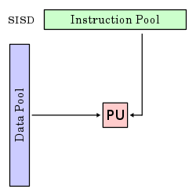
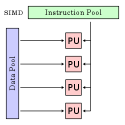
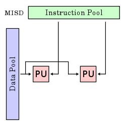
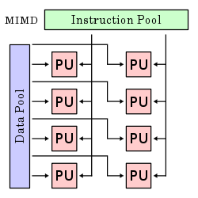

# Scientific and parallel computing

```{image} ./figures/nasasuperpc.jpg
:alt: SuperComputer
:width: 350px
:align: right
```

> ``**Computational science** (also *scientific computing* or *scientific computation* (SC)) is a rapidly growing multidisciplinary field that uses advanced computing capabilities to *understand and solve complex problems*. It is an area of science which spans many disciplines, but at its core it involves the development of *models and simulations to understand natural systems*.'' - Wikipedia

**What are the applications?**

* Computational finance,
* Computational biology,
* Simulation of complex systems,
* Network analysis
* Multi-physics simulations,
* Weather and climate models,
* ... 


Why the need for *parallelism*?

> "The complexity for minimum component costs has increased at a rate of roughly a factor of two per year. Certainly over the short term this rate can be expected to continue, if not to increase. Over the longer term, the rate of increase is a bit more uncertain, although there is no reason to believe it will not remain nearly constant for at least 10 years." - G. Moore, 1975


```{image} ./figures/mooreslawoftransistors.png
:alt: Moore's Law of Transistor
:width: 350px
:align: left
```

Computers **should** reach the physical limits of Moore's Law at some point in the 2020s... exponential functions saturates physical capabilities!

* We are hitting the wall of single processor transistor count/computing capabilities,
* Some applications needs more memory than the one that could be available on a single machine,
* Optimization of sequential algorithms can bring us only to a certain extent

Therefore, we need

* Algorithms that can work in parallel,
* A communications protocol for parallel computation integrated with our programming languages
* Parallel machines that can actually run this code

## Flynn's Taxonomy

Let us start from the bottom: the **machines**.

What is a parallel computer? ... well, it can be a certain number of different "things"
* Multi-core computing
* Symmetric multiprocessing
* Distributed computing
* Cluster computing
* Massively parallel computing
* Grid computing
* General-purpose computing on graphics processing units (GPGPU)
* Vector processors

Let us **abstract** from the machine by describing Flynn's taxonomy 

SISD | SIMD | MISD | MIMD 
-----|------|------|-----
|||
Single instruction stream, single data stream | Single instruction stream, multiple data stream | Multiple instruction stream, single data stream | Multiple instruction stream, multiple data stream

## Parallel Computers: our computer model

For our task of introducing parallel computations we need to fix a **specific multiprocessor model**, i.e., a specific generalization of the sequential RAM model in which there is more than one processor.

```{image} ./figures/networkarchitecture.png
:alt: Network Architecture
:width: 350px
:align: left
```

Since we want to stay in a SIMD/MIMD model, we focus on a *local memory machine model*, i.e., a set of $M$ processors each with its own local memory that are attached to a common communication network.

* We can be more precise about the connection between processors, one can consider a network (a collection of switches connected by communication channels) and delve in a detailed way into its pattern of interconnection, i.e., into what is called the network topology.
*  An alternative is to summarize the network properties in terms of two parameters: **latency** and **bandwidth**
    * **Latency** the time it takes for a message to traverse the network;
    * **Bandwidth** the rate at which a processor can inject data into the network.

## The TOP500 List

> "...  we have decided in 1993 to assemble and maintain a list of the 500 most powerful computer systems. Our list has been compiled twice a year since June 1993 with the help of high-performance computer experts, computational scientists, manufacturers, and the Internet community in general... In the present list (which we call the TOP500), we list computers ranked by their performance on the [**LINPACK Benchmark**](http://www.netlib.org/benchmark/hpl/)" 

The **LINPACK** Benchmark.

Solution of a dense $n\times n$  system of linear equations $A\mathbf{x} = \mathbf{b}$, so that
* $\frac{\| A \mathbf{x} - \mathbf{b}\|}{\|A\|\|\mathbf{x}\| n \varepsilon} \leq O(1)$, for $\varepsilon$ machine precision,
* It uses a specialized right-looking LU factorization with look--ahead
* Measuring 
    * $R_\text{max}$ the performance in GFLOPS for the largest problem run on a machine,
    * $N_\text{max}$ the size of the largest problem run on a machine,
    * $N_{1/2}$ the size where half the $R_\text{max}$ execution rate is achieved,
    * $R_{\text{peak}}$ the theoretical peak performance GFLOPS for the machine.

# Parallel Algorithms

In a fairly general way we can say that a **parallel algorithm** is an algorithm which can do *multiple operations* in a given time.

> **Example.** the sum of two vectors $\mathbf{x}, \mathbf{y} \in \mathbb{R}^n$
\begin{equation*}
    \begin{array}{cl}
    \mathbf{x} & = [x_1 \; x_2 \; \cdots \; x_i  \;| x_{i+1} \; \cdots x_n] \\
    + \\
    \mathbf{y} & = [y_1 \; y_2 \; \cdots \; y_i  \;| y_{i+1} \; \cdots y_n] \\
    = \\
    \mathbf{x} + \mathbf{y} & = [x_1+y_1 \; x_2+y_2 \; \cdots \; x_i+y_i  \;| \cdots x_n+y_n] \\
    \end{array}
\end{equation*}
>* If we do the operation sequentially we do $O(n)$ operations in $T_n$
>* If we split the operation among $2$ processors, one summing up the entries between $1,\ldots,i$, and one summing up the entries between $i+1,\ldots,n$ we take $T_i$ time for the first part and $T_{n-i}$ time for the second, therefore the overall time is $\max(T_{i},T_{n-i})$ for doing always $O(n)$ operations.

## Parallel Algorithms: *speedup*

Let us try to think again in an abstract way and to quantify the **overall speed gain** for a given gain in a subset of a process.
* We break some process into $N$ distinct portions with the $i$th portion occupying the $P_i$ fraction of the overall completion time,
* then we order such portion in such a way that the $N$th portions subsumes all the parts of the overall processes that have fixed costs.
* The **speedup** of the $i$th portion can then be defined as 
\begin{equation*}
    S_i \triangleq \frac{t_{\text{original}}}{t_{\text{optimized}}}, \quad i=1,\ldots,N-1
\end{equation*}
where the numerator and denominator are the original and optimized completion time.

```{admonition} Amdahl's Law
Then the *overall speedup* for $\mathbf{P} = (P_1,\ldots,P_N)$, $\mathbf{S} = (S_1,\ldots,S_{N-1})$ is:
\begin{equation*}
S(\mathbf{P},\mathbf{S}) = \left(P_N + \sum_{i=1}^{N-1} \frac{P_i}{S_i}\right)^{-1}.
\end{equation*}
```

Let us make some observations on Amdahl's Law
* We are not assuming about whether the original completion time  involves some optimization,
* We are not making any assumption on what our optimization process is,
* We are not even saying that the process in question involves a computer!
Amdahl's Law is a fairly general way of looking at how processes can be speed up by dividing them into sub-tasks with lower execution time. 

Moreover, it fixes  the *theoretical maximum speedup* in various scenarios.
* If we allow all components $S_i$ to grow unbounded then the upper bound on all scenario si $S_{\text{max}} = 1/P_N$.
Let us decline it in the context of the potential utility of *parallel hardware*.

## Parallel Algorithms: Amdahl's Law for parallel hardware

Consider now having a parallel machine that permits us dividing the execution of code across $M$ hardware units, then the problem independent maximum speedup that such hardware can provide is $M$.

```{admonition} Parallel Efficiency.
We define the parallel efficiency $E$ as
 \begin{equation*}
E \triangleq \frac{S_{\text{overall}}}{M},
 \end{equation*}
 where $E = 100\%$ correspond to the maximal use of the available hardware. When $S_{\text{max}} < M$, it is then impossible to take full advantage of all available execution units.
``` 

>**Goal:** we require very large $S_{\text{max}}$ and correspondingly tiny $P_N$. 

```{warning}
**Every dusty corner of a code must scale**, any portion that doesn't becomes the rate-limiting step!
```


What we are neglecting and what we are tacitly assuming

* We are neglecting \emph{overhead costs}, i.e., the cost associated with parallel execution such as
    * initializing (spawning) and joining of different computation threads,
    * communication between processes, data movement and memory allocation.
* We considered also the ideal case in which $S_i \rightarrow +\infty$ $\forall i$, observe that with finite speedup on portions $1$ through $N-1$, the $S_{\text{overall}}$ might continue to improve with increasing number of execution units.
* We are assuming that the size of the problem remains fixed while the number of execution units increases, this is called the case of **strong scalability**. In some contexts, we need to turn instead to **weak scalability** in which the problem size grows proportionally to the number of execution units.
